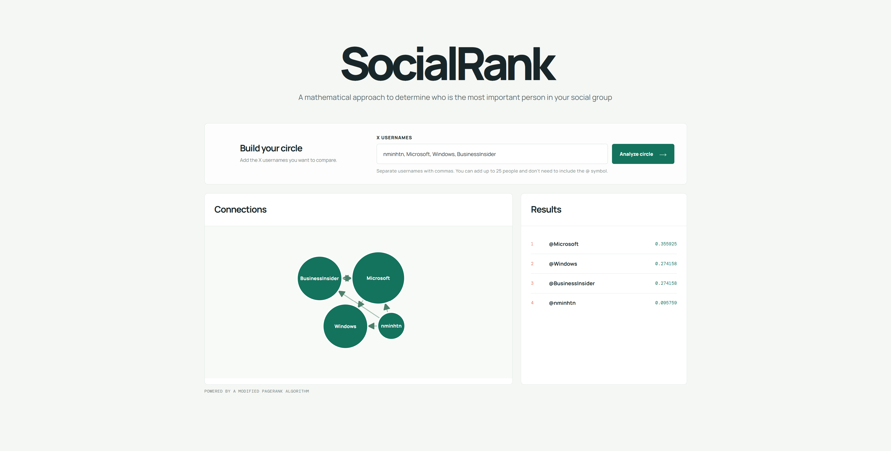

# SocialRank
A mathematical and visualized approach to determine social influence in social networks!

## Ideas & Inspiration
This is one of my first projects where the primary motivation wasn't to learn a specific technical skill or to make a full-stack application that would look nice on a resume, but instead just 'That seems pretty cool!'

The idea originally stemmed from a lecture in one of my introductory CS courses during my 1st year, where my professor was listing practical applications of the graph data structure. Things really kicked off a few months later when I watched a [Veritasium](https://www.youtube.com/@veritasium) video about Markov chains and its role in the PageRank algorithm - the foundation of the original Google Search Engine. 

That video didn't go into much detail about the PageRank algorithm since it also covered a lot of other different topics. So after a quick search, I found an excellent video by [Reducible](https://www.youtube.com/@Reducible) that explains it really well. This video, and the original research paper by Sergey Brin & Larry Page, serve as the ___absolute___ foundation of this project.

I wouldn't bother you with the specific mathematical details, but in case you're a big nerd like me and want to find out more:
* [Veritasium - Markov Chains](https://www.youtube.com/watch?v=KZeIEiBrT_w&t=1644s)
* [Reducible - PageRank](https://www.youtube.com/watch?v=JGQe4kiPnrU)
* [OG PageRank Paper](https://gwern.net/doc/technology/google/1998-page.pdf)

## How It Works & Limitations
The program itself is quite simple:
* Adds all of the entered usernames as nodes to the graph
* Uses X API to check the relationship between the usernames and adds edges correspondingly
* Runs PageRank algorithm on the completed graph
* Returns rankings and graph visualization to the user

There are a few obvious limitations:
* The graph construction is very computationally expensive, and for a lot of users, you will run out of API calls
* The algorithm measures relative importance in a local social network, not _actual_ social influence (it is possible for one of your friends to be ranked higher than Elon Musk, for example)

## Demo
When I started working on this project, the primary focus was on the PageRank algorithm itself, which is why I decided to make the UI as simple as possible. 
If you want to test it out yourself:
* Download the code. Install Flask, NumPy and Requests if you don't already have them
* Get an API key from [GetXAPI](https://www.getxapi.com/) (Don't worry, you'll get quite a lot of free calls before it costs anything)
* Enter the X usernames of your friends or whoever that you follow
* Wait for the algorithm to work its magic
* Marvel at whoever is the 'soul' of your social group (apparently for me it's Microsoft!)

## Additional Notes
_(You can completely skip this section if you want to)_

Those who work with graphs (especially in Python) will know that there is a very popular library called NetworkX that already has the PageRank algorithm fully implemented.
There are a few reasons why I still implemented it myself from scratch:
* It's a very interesting learning opportunity. Implementing it from scratch means you understand the algorithm very deeply
* Also related to the above, the NetworkX PageRank algorithm is very unintuitive to look at. It wouldn't feel as nice if I used a tool I barely understood for a project like this
* The power iteration part relates nicely to what I learned in Linear Algebra, I think this applies to the majority of university students as well
* For those who want to download and mess around with the code, they can directly modify the algorithm as they please and won't have to care about how the NetworkX library works
* It's also very interesting to compare the results between the 2 algorithms. Both are based on the same logic but implemented slightly differently with different features

One last note on the math, if you check out the resources linked above, you will realize that _dangling nodes_ are mentioned quite frequently as an issue of the original PageRank algorithm, since websites usually can't represent ideal Markov chains for stationary probability distribution convergence. There are many fixes to get the lost probability back. For this project, I chose to connect the dangling nodes to the rest of the graph with equal probabilities. If you want to test out other methods, the code is at your disposal. 

I don't expect anyone to read the entire file, but if you're reading this, thank you so much for your interest in my work. It was a fun experiment for me and I hope you've learned something new, just as I have.
